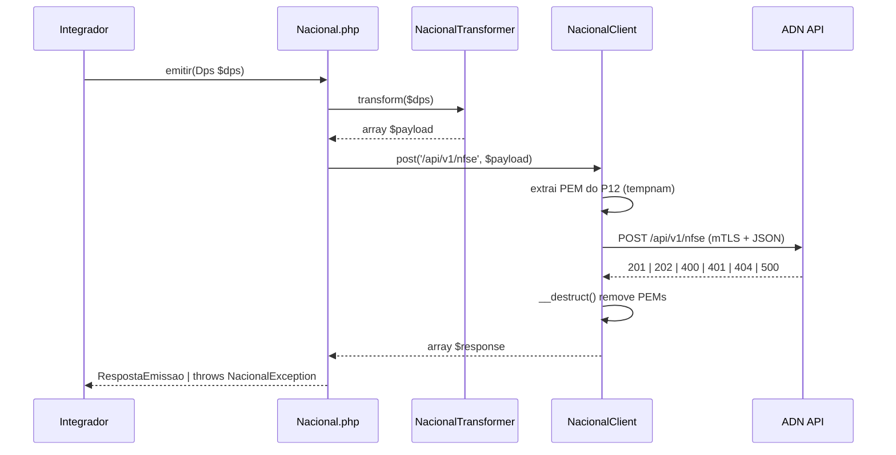

# Arquitetura do Projeto php-nfse

## Visão Geral do Projeto

Este projeto é um ecossistema PHP para abstração de emissão de **NFS-e (Nota Fiscal de Serviços eletrônica)** construído sobre o fork `nfephp-org/sped-nfse`. Ele fornece uma camada unificada que permite ao integrador trabalhar com múltiplos padrões municipais sem conhecer os detalhes de cada webservice.

O projeto nasceu num contexto de **fragmentação de padrões**: cada município brasileiro historicamente definiu seu próprio esquema XML e webservice SOAP. A biblioteca abstrai essa diversidade através de um mecanismo de seleção automática por código IBGE (cmun), permitindo que o código do integrador permaneça igual independentemente do município destino.

A partir de 2026, o governo federal introduziu o **Padrão Nacional NFS-e (ADN)** — uma API REST/JSON centralizada que coexistirá com os sistemas municipais legados durante o período de transição. Este projeto evolui para suportar ambos os mundos num único ponto de entrada.

```
                        [ Integrador / ERP ]
                               │
                        [ NFSe  (Entry Point) ]
                               │
                    [ NFSeStatic  (Factory) ]
                    /           |            \
         cmun = IBGE       cmun = IBGE     cmun = 0000000
              │                 │                 │
    [ Counties/M{IBGE} ]  [ Models/{Modelo} ]  [ Nacional ]
    (sobreposição local)  (padrão SOAP/XML)    (REST/JSON ADN)
```

---

## Padrões de Projeto Utilizados

### Factory (Criação de Provedores por IBGE)

**Onde:** `src/NFSeStatic.php`

A classe `NFSeStatic` implementa uma **Factory Estática dinâmica**. Dado o código IBGE do município (`cmun`), ela resolve o nome da classe PHP de forma programática e a instancia:

```php
// NFSeStatic::getClassName() resolve para:
// \NFePHP\NFSe\Counties\M{cmun}\{Complement}
// Ex: cmun=3550308 → \NFePHP\NFSe\Counties\M3550308\Tools

private static function getClassName(stdClass $config, $complement)
{
    return "\NFePHP\NFSe\Counties\\M$config->cmun\\$complement";
}
```

**Regra de fallback:** Se não existe uma classe municipal específica (`Counties/M{cmun}/Tools`), a factory sobe para o modelo padrão do município (`Models/{Modelo}/Tools`) conforme configurado. Isso cria um sistema de **delegação em cascata**:

```
Counties/M3502101/Tools   →  (não existe?)
Models/Issnet/Tools       →  (usa este)
Common/Tools              →  (contrato abstrato)
```

**Extensão para o Padrão Nacional:** A factory reconhecerá `cmun = '0000000'` (código reservado) ou flag `isPadraoNacional()` para retornar `Providers/Nacional/Nacional` em vez dos provedores SOAP legados.

### Strategy (Provedores Intercambiáveis)

**Onde:** `src/Common/Tools.php` (contrato abstrato)

Todos os provedores municipais seguem o mesmo contrato ao estender `Common\Tools`. Cada implementação concreta encapsula o protocolo de comunicação (SOAP 1.1, SOAP 1.2, mTLS REST) e os detalhes do schema sem alterar a interface pública.

```
Common\Tools  (abstract — contrato Strategy)
    ↑
Models\Issnet\Tools        Models\Abrasf\Tools        Providers\Nacional\Nacional
    ↑
Counties\M3502101\Tools    (sobreposição municipal)
```

O integrador chama sempre `$nfse->tools->enviarRps($rps)` sem saber qual implementação está por baixo.

### Template Method (Fluxo de Envio)

**Onde:** `src/Common/Tools.php` + `src/Common/Factory.php`

A classe abstrata `Common\Tools` define o esqueleto do fluxo de envio, delegando os passos variáveis (`sendRequest`, URLs, namespaces) para as subclasses. `Common\Factory` encapsula a lógica invariante de validação XSD, assinatura XML-DSig e manipulação de certificado.

---

## Fluxo de Uma Emissão

### Legado SOAP/XML (Padrões Municipais)

```
Integrador
   │  1. $nfse = new NFSe($configJson, $certificate)
   ▼
NFSe.php
   │  2. NFSeStatic::tools($config, $cert)
   ▼
NFSeStatic.php
   │  3. Resolve \NFePHP\NFSe\Counties\M{cmun}\Tools
   │     (ou Models\{Modelo}\Tools por fallback)
   ▼
Counties\M{cmun}\Tools  (extends Models\{Modelo}\Tools)
   │  4. $nfse->tools->enviarRps($rps)
   ▼
Models\{Modelo}\Tools
   │  5. Constrói XML do RPS via Models\{Modelo}\Factories\EnviarRps
   │  6. Common\Factory::validar() → valida contra XSD
   │  7. Common\Factory::signer() → assina com certificado (XML-DSig)
   │  8. SoapInterface::send($url, $xml)
   ▼
Webservice Municipal (SOAP)
   │  9. Resposta SOAP XML
   ▼
Common\Response::readReturn()
   │  10. XML → stdClass
   ▼
Integrador recebe stdClass com dados da NFS-e
```

### Novo Padrão Nacional REST/JSON (ADN)

```
Integrador
   │  1. $config = new ConfiguracaoNacional($p12, $senha, $ambiente)
   │     $provider = new Nacional($config)
   ▼
Nacional.php
   │  2. $provider->emitir($dps)
   ▼
NacionalTransformer.php
   │  3. transform(Dps $dps): array
   │     Serializa todos os blocos: infDPS, emit, tomador, serv, valores
   ▼
NacionalClient.php
   │  4. Extrai cert/key do P12 → arquivos PEM temporários (tempnam, chmod 0600)
   │  5. Guzzle HTTP POST /api/v1/nfse com CURLOPT_SSLCERT + CURLOPT_SSLKEY (mTLS)
   ▼
ADN (hom.nfse.gov.br / www.nfse.gov.br)
   │  6. Resposta JSON:
   │     HTTP 201 → RespostaEmissao(status='EMITIDA', chaveAcesso, numeroNfse)
   │     HTTP 202 → RespostaEmissao(status='ACEITA', protocolo)
   │     HTTP 400 → ValidationException(erros[])
   │     HTTP 401/403 → AuthException
   │     HTTP 404 → NotFoundException
   │     HTTP 500/503 → AdnException
   ▼
NacionalClient.php
   │  7. __destruct() remove arquivos PEM temporários
   ▼
Integrador recebe RespostaEmissao (value object)
```



---

## Estrutura de Diretórios Críticos

```
php-nfse/
├── src/
│   ├── NFSe.php                    # Entry point público do pacote
│   ├── NFSeStatic.php              # Factory estática (resolução por cmun)
│   │
│   ├── Common/                     # Contratos abstratos e utilitários compartilhados
│   │   ├── Tools.php               # Classe abstrata base — todos os provedores SOAP herdam
│   │   ├── Rps.php                 # Classe base para construção do RPS
│   │   ├── Factory.php             # Validação XSD, assinatura XML-DSig, manipulação de cert
│   │   └── Response.php            # Parser de respostas SOAP XML → stdClass
│   │
│   ├── Models/                     # Implementações dos padrões SOAP municipais
│   │   ├── Abrasf/                 # Padrão ABRASF (v100, v200, v201, v202, v203) — o mais comum
│   │   ├── Issnet/                 # Padrão ISSNET
│   │   ├── Betha/                  # Padrão Betha
│   │   ├── Ginfes/                 # Padrão GINFES
│   │   ├── Prodam/                 # Padrão Prodam (São Paulo)
│   │   └── ...                     # +11 padrões municipais
│   │   # Cada modelo contém: Tools.php, Rps.php, Response.php, Convert.php, Factories/
│   │
│   ├── Counties/                   # Sobreposições municipais (por código IBGE)
│   │   ├── M3550308/               # São Paulo, SP (IBGE 3550308)
│   │   │   ├── Tools.php           # extends Models\Abrasf\Tools; define URL + xmlns
│   │   │   ├── Rps.php
│   │   │   ├── Response.php
│   │   │   └── Convert.php
│   │   ├── M3502101/               # Andradina, SP
│   │   └── ...                     # 64 municípios implementados
│   │
│   └── Providers/                  # [EM DESENVOLVIMENTO] Provedores de nova geração
│       └── Nacional/               # Padrão Nacional REST/JSON (ADN)
│           ├── Nacional.php        # Provider principal (implements NacionalProviderInterface)
│           ├── NacionalClient.php  # Cliente HTTP Guzzle + mTLS
│           ├── NacionalTransformer.php  # Serialização Dps → JSON array
│           ├── ConfiguracaoNacional.php # Value object de configuração (PRODUCAO/HOMOLOGACAO)
│           ├── Models/             # Value objects do modelo DPS
│           │   ├── Dps.php         # Documento Prestação de Serviço (builder pattern)
│           │   ├── Emitente.php
│           │   ├── Tomador.php
│           │   ├── Servico.php
│           │   ├── Valores.php
│           │   └── ...             # +9 value objects
│           ├── Responses/          # Objetos de resposta (somente leitura)
│           │   ├── RespostaEmissao.php
│           │   ├── RespostaConsulta.php
│           │   └── RespostaCancelamento.php
│           ├── Exceptions/         # Hierarquia de exceções tipadas
│           │   ├── NacionalException.php    # Base
│           │   ├── ValidationException.php  # HTTP 400/422
│           │   ├── AuthException.php        # HTTP 401/403
│           │   ├── NotFoundException.php    # HTTP 404
│           │   ├── AdnException.php         # HTTP 500/503
│           │   └── TimeoutException.php     # Timeout cURL
│           └── Interfaces/
│               ├── NacionalProviderInterface.php
│               └── NacionalTransformerInterface.php
│
├── schemes/                        # XSD schemas para validação de XML SOAP
│   └── Models/
│       ├── Abrasf/                 # XSDs por versão (v100, v200, v201, v202, v203)
│       ├── Issnet/
│       └── ...
│
├── tests/
│   └── Providers/
│       └── Nacional/
│           ├── Unit/               # Testes unitários (sem I/O externo)
│           ├── Integration/        # Testes contra ADN homologação
│           └── Fixtures/           # Payloads JSON de exemplo (req/resp)
│
├── examples/                       # Scripts de exemplo por modelo municipal
│   ├── issnet/
│   ├── abrasf/
│   └── ...
│
├── specs/                          # Especificações de features (Spec Kit workflow)
│   └── 001-provedor-nacional/
│       ├── spec.md, plan.md, tasks.md
│       ├── research.md, data-model.md, quickstart.md
│       └── contracts/
│           ├── api-nacional.md     # Contrato REST do ADN
│           └── php-interface.md    # Interfaces PHP públicas
│
└── composer.json                   # PSR-4: NFePHP\NFSe → src/
```

---

## Evolução para o Padrão Nacional

### Contexto da Mudança

O Padrão Nacional NFS-e (ADN — Ambiente de Dados Nacional) introduz uma ruptura arquitetural com o legado municipal:

| Dimensão | Legado Municipal | Padrão Nacional |
|----------|-----------------|-----------------|
| Protocolo | SOAP 1.1 / SOAP 1.2 | REST/JSON (HTTPS) |
| Autenticação | Assinatura XML-DSig no payload | mTLS (certificado no canal TLS) |
| Documento | RPS (XML, por schema municipal) | DPS — Declaração de Prestação de Serviço (JSON, schema nacional único) |
| Endpoint | Webservice municipal (por cidade) | API centralizada federal |
| Ambiente | Produção/Homologação por município | `www.nfse.gov.br` / `hom.nfse.gov.br` |
| Resposta | XML SOAP → parser manual | JSON → value objects tipados |

### Estratégia de Convivência

A estratégia adotada é de **adição sem alteração do core legado**:

1. **Namespace isolado:** O novo provider vive em `src/Providers/Nacional/` com namespace `NFSe\Nacional`, completamente isolado de `NFePHP\NFSe\Common` e `NFePHP\NFSe\Models`. Não há herança do `Common\Tools` legado.

2. **Ponto de entrada unificado:** A factory `NFSeStatic` será atualizada para reconhecer o Padrão Nacional sem alterar o contrato existente:
   ```php
   // No NFSeStatic, antes de resolver Counties/M{cmun}:
   if ($config->isPadraoNacional() || $config->cmun === '0000000') {
       return new \NFSe\Nacional\Nacional($config->getNacionalConfig());
   }
   ```

3. **Interfaces independentes:** `NacionalProviderInterface` define os contratos públicos (`emitir`, `consultar`, `cancelar`) sem depender de interfaces SOAP. O integrador que migrar do municipal para o nacional trocará apenas a instanciação — os métodos permanecem semanticamente equivalentes.

4. **Dependências próprias:** O provider Nacional usa `guzzlehttp/guzzle ^7.0` para HTTP em vez do `SoapInterface` legado. O certificado continua usando `NFePHP\Common\Certificate` do sped-common para extração do P12, mas a autenticação é feita via cURL (mTLS) em vez de assinatura XML.

5. **Zero breaking changes:** Todos os 64 municípios existentes em `Counties/` e os 16 modelos em `Models/` continuam funcionando sem alteração. A adição do provider Nacional é aditiva.

### Diagrama de Coexistência

```
NFSe::tools($config, $cert)
        │
        ├─── cmun ∈ [3550308, 3502101, ...]  →  Counties/M{cmun}/Tools
        │                                        (SOAP/XML legado)
        │
        ├─── cmun não tem sobreposição        →  Models/{Modelo}/Tools
        │    (fallback por modelo config)         (SOAP/XML legado)
        │
        └─── cmun = '0000000'                 →  Providers/Nacional/Nacional
             ou isPadraoNacional() = true          (REST/JSON ADN)
                                                  Guzzle + mTLS
                                                  DPS → JSON
```

Esta estratégia permite que municípios migrem gradualmente para o padrão federal sem que o código do integrador precise de refatoração — apenas a configuração muda.
